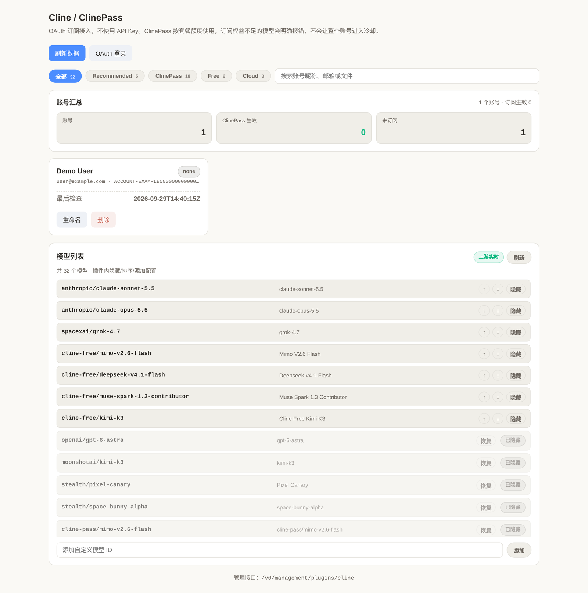

# cline-cpa-plugin

Cline / ClinePass OAuth provider plugin for
[CLIProxyAPI](https://github.com/router-for-me/CLIProxyAPI) (CPA).

The plugin is OAuth-only by design. Credentials come from Cline's WorkOS
device flow, so an API key is not required.



## Features

- WorkOS device login, returning a CPA auth record
- Cline OAuth refresh (`/api/v1/auth/refresh`)
- Cline recommended model catalog (`recommended`, `free`, `clinePass`,
  `clineCloud`), discovered from upstream and merged into the CPA model list
- Cold-cache discovery: the first model listing after a restart fetches the
  upstream catalog instead of falling back to the embedded list, so newly
  published models are visible immediately
- Forced refresh through the panel, which reports upstream fetch failures back
  to the caller rather than silently serving a stale list
- Plugin-owned model hide/order/add configuration
- Streaming and non-streaming OpenAI-compatible execution
- Management panel with model controls and account plan status
- Entitlement errors are reported clearly and never put the whole auth into
  cooldown

## Build

```bash
make build
```

Output: `cline.so`. The plugin is `-buildmode=c-shared` with CGO enabled, so
build it on the platform where CPA will run it.

## Install

Copy `cline.so` to the CPA plugins directory and enable it:

```yaml
plugins:
  enabled: true
  dir: "plugins"
  configs:
    cline:
      enabled: true
```

For a multi-platform deployment, use CPA's platform subdirectory layout
(`plugins/linux/amd64/cline.so`).

## Configuration

All keys are optional and live under `plugins.configs.cline`:

| Key | Default | Meaning |
|---|---|---|
| `models` | none | A complete model list. When set, it replaces Cline recommended-models discovery. |
| `hidden_models` | none | Plugin-owned deny-list. Hidden IDs never reach the host model registry. A trailing `*` hides a whole family, so `cline-pass/*` also covers models Cline publishes later. |
| `model_groups` | none | Group labels and ordering for the management panel. |

## Panel

The plugin registers a management page at
`/v0/resource/plugins/cline/panel`, shown in the CPA sidebar as **Cline**:

- List the effective model catalog, with groups and the source each ID came from
- Hide, restore, reorder and add models; the overlay persists in plugin config
- Force an upstream model refresh
- List accounts with subscription and plan status, and rename or delete them

The panel needs the CPA management key. It picks it up automatically when opened
from inside the CPA panel, and accepts `?key=` otherwise.

## Notes

ClinePass models require an active ClinePass subscription on the Cline account.
Free models exposed under the ClinePass provider are also registered, but are
marked as free in the model name.

When a model is not covered by the account's entitlement, the plugin returns an
explicit error for that request instead of cooling down the whole auth, so other
models on the same account keep working.

## License

[MIT](LICENSE)
